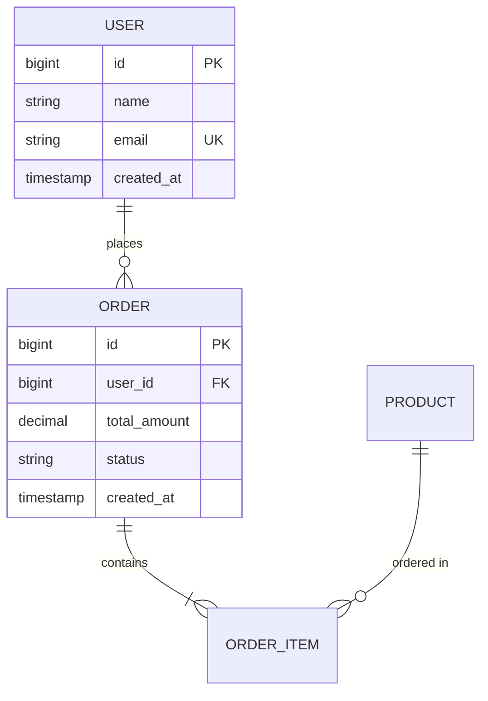

# 数据库文档模板

## 数据字典格式

```markdown
## 用户表 (users)

| 字段 | 类型 | 可空 | 默认值 | 说明 |
|------|------|------|--------|------|
| id | BIGINT | NO | AUTO | 主键 |
| name | VARCHAR(50) | NO | - | 用户名 |
| email | VARCHAR(100) | NO | - | 邮箱（唯一） |
| status | TINYINT | NO | 1 | 状态：1=正常，0=禁用 |
| created_at | TIMESTAMP | NO | CURRENT | 创建时间 |
| updated_at | TIMESTAMP | NO | CURRENT | 更新时间 |
| deleted_at | TIMESTAMP | YES | NULL | 删除时间 |

### 索引
| 索引名 | 类型 | 字段 | 说明 |
|--------|------|------|------|
| PRIMARY | 主键 | id | 主键索引 |
| uk_email | 唯一 | email | 邮箱唯一索引 |
| idx_status | 普通 | status | 状态查询索引 |
```

## 迁移脚本规范

```sql
-- migrations/20240115_001_create_users_table.sql

-- Up
CREATE TABLE users (
    id BIGINT PRIMARY KEY AUTO_INCREMENT,
    name VARCHAR(50) NOT NULL,
    email VARCHAR(100) NOT NULL,
    status TINYINT NOT NULL DEFAULT 1,
    created_at TIMESTAMP NOT NULL DEFAULT CURRENT_TIMESTAMP,
    updated_at TIMESTAMP NOT NULL DEFAULT CURRENT_TIMESTAMP ON UPDATE CURRENT_TIMESTAMP,
    deleted_at TIMESTAMP NULL,

    UNIQUE KEY uk_email (email),
    KEY idx_status (status)
) ENGINE=InnoDB DEFAULT CHARSET=utf8mb4;

-- Down
DROP TABLE IF EXISTS users;
```

## ER图模板（Mermaid）


